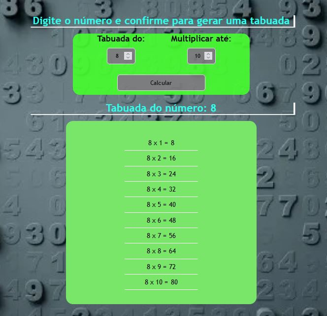
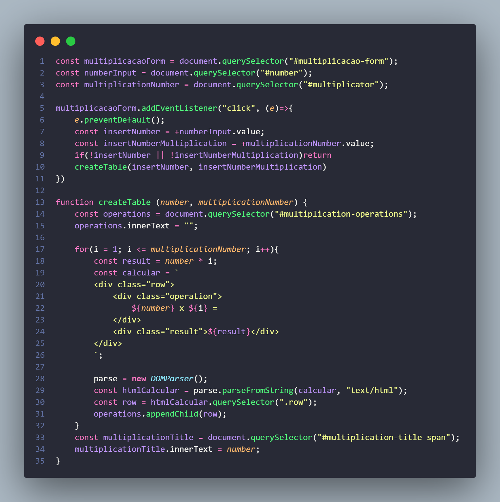

# Tabuada
Projeto Tabuado utilizando JS puro

## Descrição
Nesse projeto tabuada está sendo abordado o que foi aprendido no curso Front end - HTML, CSS, JavaScript E REACT.

## Aprendizados

O que eu aprendi construindo esse projeto? 
Criar um projeto frontend utilizando html, CSS, JavaScript, o html e css foram modificado ao meu gosto e não igual ao curso e também os nomes do eventos.

Quais desafios você enfrentou e como você superou-os?
Já tive uma familiaridade com js, pois já conhecia porem nunca tinha conseguido construir um projeto na parte de js sozinho. Estudava e não conseguia entender certamente o que os professores diziam, nesse curso estou conseguindo desenvolver minhas habilidades como nunca.
Criar as constantes e eventos foram fácies porem quando chegou na parte de função tive uma dificuldade, porem refazendo várias vezes vamos aprendendo.

## 🛠 Habilidades
Javascript, HTML, CSS...

## Outras seções comuns em perfis do GitHub

🧠 Estou aprendendo a como se torna um programador FrontEnd utilizando as tecnologia JS e React.

📫 Como entrar em contato comigo... 
📫 E-mail uevetonsp89@gmail.com  

[👉🏻 Clique aqui para acessar o site](https://ueveton.github.io/Projeto-TODO/)

## Demonstração

    

    

